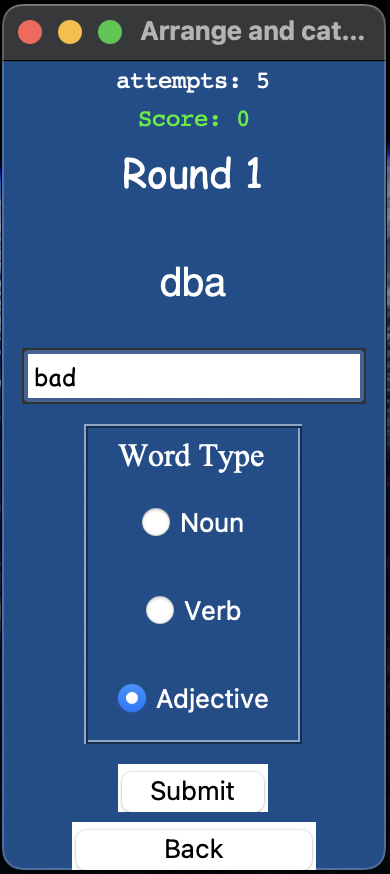

# Word Guessing Games (Python / Tkinter) 📘
A python project containing **two interactive word games** built using the **Tkinter** library. Players are challenged to **guess words** based on their definitions in one game, and on their scrambled spelling in another game, with words categorized by **difficulty levels (easy / medium/ hard)** including a mix of **nouns, verbs, and adjectives**. The games dynamically update scores and rounds, providing an engaging experience for single players.

⚠️ Note <br>
This was my **first ever project working with Tkinter and GUI development**, as well as handling CSV files for persistent account management. <br>
Some parts of the code may include **repetitive or unnecessary elements**. However, this project provided me with a solid foundation in GUI, event handling, dynamic interface updates, and data storage in Python

## Features ⚡️
- 🎯 **Game 1: Guess the definition**: Players type the correct word corresponding to the displayed definition
- 🎯 **Game 2: Arrange and Categorize**: Players are given an scrambled word to type its normal "arranged" form and to categorize it to it's type (noun / verb/ adjective)
- 📝 **Login and registration system**: Users can create accounts and login, account data is stored in a CSV file
- 📊 **Score tracking**: Player scores are updated automatically for each correct answer and saved per account
- 🔁 **Round-based gameplay**: Progress through rounds with increasingly difficult words
- 🗃️ **CSV integration**: Words, definitions, and account data are stored and loaded from CSV files
- 🎨 **GUI interface**: Fully built using Tkinter, with labels, entries, and buttons for interaction

## 🛠️ Tech Stack
- **Python 3.x**
- **Tkinter** (GUI framework)
- **CSV files** (for word definitions and account data)

## 📂 Project Structure
```
word_game_project/
│
├── words.py                  # Lists of nouns, verbs, adjectives by difficulty
├── WordDefinitionSet.py      # Lists of easy, medium, and hard words
├── words_definitions.csv     # CSV file mapping words to definitions
├── accounts.csv              # CSV file storing registered users and scores
├── main.py                   # Main file launching the GUI and games
└── README.md                 # Project documentation
```

## 🚀 How to Run
1. Make sure Python 3.x is installed
2. Place all project files in the same folder
3. Run the main GUI file <br>
    - On Windows
    ```bash
    python GUI.py
    ```

    - On macOS
    ```bash
    python3 GUI.py
    ```
4. Use the login or registration system to create an account or login
5. Follow the on-screen instructions to play the games

## 📸 Screenshots
<p><b> Login and Registration system </b></p>

&nbsp;&nbsp;


<br> 
<p><b> Game 1 </b></p>

&nbsp;&nbsp;


<br> 
<p><b> Leaderboard </b></p>


<br> 
<p><b> Game 2 </b></p>

&nbsp;&nbsp;



## License
This project is licensed under the [MIT License](LICENSE)